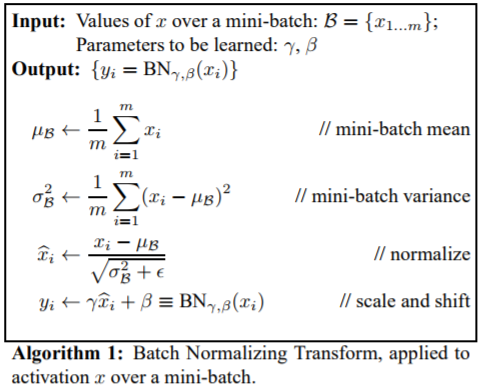

# Recommended Papers  
- 记录经典的深度学习模型.

[tensorflow](https://github.com/tensorflow)实现[model](https://github.com/tensorflow/models/tree/master/research/slim)
## Papers
Paper list.

## Image Captioning
|No.  |Figure   |Net Name |Title   |Authors  |Pub.  |Links|
|-----|:-----:|:-----:|:-----:|:-----:|:---:|:---:|
|1||LeNet|__Gradient-based learning applied to document recognition__|Cesc Chunseong Park, Byeongchang Kim and Gunhee Kim|__Proceedings of the IEEE 19987__|[PDF](http://ieeexplore.ieee.org/document/726791/)  解读|
|2||AlexNet|__ImageNet Classification with Deep Convolutional Neural Networks__|Cesc Chunseong Park, Byeongchang Kim and Gunhee Kim|__NIPS2012__|[PDF](http://papers.nips.cc/paper/4824-imagenet-classification-with-deep-convolutional-neural-networks.pdf)  解读|
|3||ZF-net|__Visualizing and understanding convolutional networks__|[Matthew D Zeiler](http://www.matthewzeiler.com/) and [Rob Fergus](http://cs.nyu.edu/~fergus/pmwiki/pmwiki.php)|__ECCV2014__|[PDF](https://arxiv.org/pdf/1311.2901.pdf)  解读|
|4|| VGG|__Very deep convolutional networks for large-scale image recognition__|Cesc Chunseong Park, Byeongchang Kim and Gunhee Kim|__ICLM2015__|[PDF](http://www.robots.ox.ac.uk/~vgg/research/very_deep/) [code](https://github.com/cesc-park/attend2u) 解读|
|5|| GoogLeNet|__Going deeper with convolutions__|Christian Szegedy, Wei Liu, Yangqing Jia, Pierre Sermanet, Scott Reed, Dragomir Anguelov, Dumitru Erhan, Vincent Vanhoucke, Andrew Rabinovich|__CVPR2015__|[PDF](https://www.cv-foundation.org/openaccess/content_cvpr_2015/html/Szegedy_Going_Deeper_With_2015_CVPR_paper.html) [code](https://github.com/tensorflow/models/blob/master/research/slim/nets/inception_v1.py) 解读|
|6|| Inception v2|__Batch normalization: Accelerating deep network training by reducing internal covariate shift__|Cesc Chunseong Park, Byeongchang Kim and Gunhee Kim|__ICML2015__|[PDF](https://arxiv.org/abs/1502.03167) [code](https://github.com/tensorflow/models/blob/master/research/slim/nets/inception_v2.py) 解读|
|7|| Inception-v3|__Rethinking the inception architecture for computer vision__|Cesc Chunseong Park, Byeongchang Kim and Gunhee Kim|__CVPR2016__|[PDF](https://arxiv.org/abs/1512.00567) [code](https://github.com/tensorflow/models/blob/master/research/slim/nets/inception_v3.py) 解读|
|7|| Inception-v4|__Inception-v4, inception-resnet and the impact of residual connections on learning__|Cesc Chunseong Park, Byeongchang Kim and Gunhee Kim|__AAAI2017__|[PDF](https://arxiv.org/abs/1602.07261) [code](https://github.com/tensorflow/models/blob/master/research/slim/nets/inception_v4.py) 解读|
|8|| ResNets|__Deep residual learning for image recognition__|Cesc Chunseong Park, Byeongchang Kim and Gunhee Kim|__CVPR2016__|[PDF](https://www.cvfoundation.org/openaccess/content_cvpr_2016/html/He_Deep_Residual_Learning_CVPR_2016_paper.html) [github](https://github.com/KaimingHe/deep-residual-networks) 解读|
|9|| ResNets|__Identity mappings in deep residual networks__|Cesc Chunseong Park, Byeongchang Kim and Gunhee Kim|__ECCV2016__|[PDF](https://link.springer.com/chapter/10.1007/978-3-319-46493-0_38) [code](https://github.com/cesc-park/attend2u) 解读|
|10|| DenseNets|__Densely Connected Convolutional Networks__|[Huang, Gao](http://www.cs.cornell.edu/~gaohuang/) and [Liu, Zhuang](https://liuzhuang13.github.io/) and, [Laurens van der Maaten](https://lvdmaaten.github.io/), [Kilian Q Weinberger](https://www.cs.cornell.edu/~kilian/)|__CVPR2017__|[PDF](https://arxiv.org/pdf/1608.06993.pdf) [github](https://github.com/liuzhuang13/DenseNet) 解读|
|11|| DenseNets|__Deep Pyramidal Residual Networks__|Dongyoon Han, Jiwhan Kim, Junmo Kim|__CVPR2017__|[PDF](https://arxiv.org/pdf/1610.02915.pdf) [github](https://github.com/jhkim89/PyramidNet) 解读|
|12|| FPN|__Feature Pyramid Networks for Object Detection__|Tsung-Yi Lin, Piotr Dollár, Ross Girshick, [Kaiming He](http://kaiminghe.com/), Bharath Hariharan, and Serge Belongie|__CVPR2017__|[PDF](https://arxiv.org/pdf/1612.03144.pdf) [github]() 解读|
|13|| ResNeXt|__Aggregated Residual Transformations for Deep Neural Networks__|Saining Xie, Ross Girshick, Piotr Dollár, Zhuowen Tu, Kaiming He|__CVPR2017__|[PDF](https://arxiv.org/abs/1611.05431) [github](https://github.com/facebookresearch/ResNeXt) 解读|
|14|| DRNs|__Dilated Residual Networks__|Fisher Yu, Vladlen Koltun, Thomas Funkhouser|__CVPR2017__|[PDF](https://arxiv.org/abs/1705.09914) [github]| 解读|

 

 

