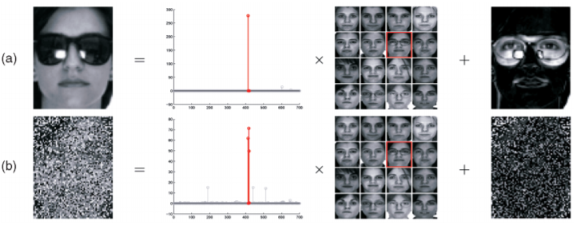

# Sparse Learning  
## [Home](../../README.md)
- The goal of this document is to provide a reading list in Sparse learning.

## Topics
- [Tasks](#tasks)
- [Papers](#papers)
- [Lab](#lab)
- [People](#people)
- [Datasets](#datasets)
- [Software](#software)
- [References](#references) 

## tasks
__Sparse representation based classification__ (SRC) seeks to represent the testing data with a sparse linear combination of training data. SRC assumes that, if sufficient training samples are available from each class, it is possible to represent each testing sample by a linear combination of a sparse subset of the training samples. The class label of the testing sample is assigned as the class with the minimum representation residual over all classes. 

})

[Topics](#topics)

## Papers
Paper list.

|No.  |Figure   |Title   |Authors  |Pub.  |Links|Datasets|
|-----|:-----:|:-----:|:-----:|:-----:|:---:|:---:|
|1||__Learning from Partial Labels__|[Timothee Cour](http://www.timotheecour.com/) [Benjamin Sapp](https://scholar.google.com.hk/citations?hl=zh-CN&user=aPqcyU4AAAAJ&view_op=list_works&sortby=pubdate) [Benjamin Sapp](https://scholar.google.com.hk/citations?hl=zh-CN&user=ygFAcZwAAAAJ&view_op=list_works&sortby=pubdate)|__[JMLR 2011](http://ieeexplore.ieee.org/xpl/RecentIssue.jsp?punumber=34)__|[PDF](http://www.jmlr.org/papers/volume12/cour11a/cour11a.pdf)| |

[Topics](#topics)

## Lab

[Topics](#topics)

## People

[Topics](#topics)

## Datasets

[Topics](#topics)

## Software

[Topics](#topics)

## References

[Topics](#topics)

[Latex formula](http://latex.codecogs.com/)