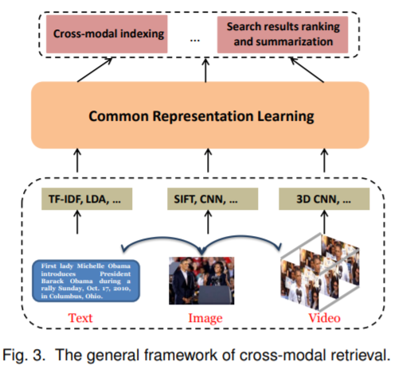

# Recommended Papers  
## [Home](../README.md)
- The goal of this document is to provide a reading list in Multimodal learning.

## Topics
- [Cross-modal retrieval](#cross-modal-retrieval)
- [Image Captioning](image_captioning/image_captioning.md)
- [Video Descriptions](#video-descriptions)
- [Visual Question-Answer (VQA)](#visual-question-answer)
- [Human Pose Estimation](#human_pose_estimation)
- [Emotion](emotion/emotion.md)
- [Medical](medical/medical.md)
- [3D Object Classification](#3d_object_classification)
- [Audio](audio/audio.md)
- [Video](vedio/vedio.md)
- [Others](#others)
- [Multimodal Machine Learning](https://sites.google.com/site/multiml2016cvpr/)

## Five main __challenges__ in multimodal machine learning [link](https://sites.google.com/site/multiml2016cvpr/)
-  multimodal representation learning
-  translation & mapping
-  modality alignment
-  multimodal fusion 
-  co-learning

[A review of affective computing: From unimodal analysis to multimodal fusion](http://sentic.net/affective-computing-review.pdf)

## Papers
Paper list.

## Cross-modal retrieval

### 2017
|No.  |Figure   |Title   |Authors  |Pub.  |Links|Datasets|
|-----|:-----:|:-----:|:-----:|:-----:|:---:|:---:|
|1||__Deep Cross-Modal Hashing__| [Qing-Yuan Jiang](http://lamda.nju.edu.cn/jiangqy/) and [Wu-Jun Li](https://cs.nju.edu.cn/lwj/)|__CVPR 2017__|[PDF](http://lamda.nju.edu.cn/jiangqy/paper/CVPR17_DCMH.pdf)  解读| [MIRFLICKR-25K]() [NUS-WIDE]() [IAPR TC-12]()|
|2||__Learning Deep Structure-Preserving Image-Text Embeddings__| L. Wang, Y. Li, and [S. Lazebnik](http://web.engr.illinois.edu/~slazebni/)|__PAMI 2017__|[PDF](http://web.engr.illinois.edu/~slazebni/publications/pami17_twobranch.pdf) ||
|3||__Pairwise Relationship Guided Deep Hashing for Cross-Modal Retrieval__| Erkun Yang, [Cheng Deng](https://scholar.google.com.hk/citations?hl=zh-CN&user=OROjmc8AAAAJ&view_op=list_works&sortby=pubdate), Wei Liu, Xianglong Liu, Dacheng Tao, Xinbo Gao|__AAAI 2017__|[PDF](https://aaai.org/ocs/index.php/AAAI/AAAI17/paper/view/14326/13959) ||

### 2016
|No.  |Figure   |Title   |Authors  |Pub.  |Links|Datasets|
|-----|:-----:|:-----:|:-----:|:-----:|:---:|:---:|
|1||__Learning Deep Structure-Preserving Image-Text Embeddings__| L. Wang, Y. Li, and [S. Lazebnik](http://web.engr.illinois.edu/~slazebni/)|__CVPR 2016__|[PDF](http://web.engr.illinois.edu/~slazebni/publications/cvpr16_structure.pdf)||
|2||__A Comprehensive Survey on Cross-modal Retrieval__|Kaiye Wang, Qiyue Yin, Wei Wang, Shu Wu, Liang Wang||[PDF](https://arxiv.org/pdf/1607.06215.pdf)||

## Video Descriptions

### code
[视频内容问答](https://www.leiphone.com/news/201705/qtBJ3lsLVJ1TPrwK.html)

## Visual Question-Answer

[VQA Challenge](http://visualqa.org/)
[other resource](https://github.com/JamesChuanggg/awesome-vqa)

## Human Pose Estimation

### 2013
|No.  |Figure   |Title   |Authors  |Pub.  |Links|Datasets|
|-----|:-----:|:-----:|:-----:|:-----:|:---:|:---:|
|1||__MODEC: Multimodal Decomposable Models for Human Pose Estimation__| Ben Sapp, Ben Taskar|__CVPR 2013__|[PDF](https://www.cv-foundation.org/openaccess/content_cvpr_2013/papers/Sapp_MODEC_Multimodal_Decomposable_2013_CVPR_paper.pdf)  解读| 

## 3D Object Classification

### 2012
|No.  |Figure   |Title   |Authors  |Pub.  |Links|Datasets|
|-----|:-----:|:-----:|:-----:|:-----:|:---:|:---:|
|1||__Convolutional-Recursive Deep Learning for 3D Object Classification__|[Richard Socher](http://www.socher.org/), Brody Huval, Bharath Bhat, [Christopher D. Manning](https://nlp.stanford.edu/manning/), Andrew Y. Ng |__NIPS 2012__|[PDF](http://papers.nips.cc/paper/4773-convolutional-recursive-deep-learning-for-3d-object-classification.pdf) [Projeact](http://www.socher.org/index.php/Main/Convolutional-RecursiveDeepLearningFor3DObjectClassification)||

## Others
### 2013
|No.  |Figure   |Title   |Authors  |Pub.  |Links| Datasets |
|-----|:-----:|:-----:|:-----:|:-----:|:---:|:---:|
|1||__Zero-Shot Learning Through Cross-Modal Transfer__|[Richard Socher](http://www.socher.org/)and Milind Ganjoo and [Christopher D. Manning](https://nlp.stanford.edu/manning/) and Andrew Y. Ng |__NIPS 2013__|[PDF](https://nlp.stanford.edu/~socherr/SocherGanjooManningNg_NIPS2013.pdf) [Projeact](http://www.socher.org/index.php/Main/Zero-ShotLearningThroughCross-ModalTransfer)||

### 团队

[中科院模式识别国家重点实验室](http://www.nlpr.ia.ac.cn/CN/model/index.shtml)

[中科院计算所视觉信息处理与学习组](http://vipl.ict.ac.cn/)

[MultiComp Lab of University of Southern California (USC)](http://multicomp.ict.usc.edu/)

[MultiComp Lab of Carnegie Mellon University](http://multicomp.cs.cmu.edu/)

### 关注的人

[杨敏](http://minyang.me/)
[王树徽](http://vipl.ict.ac.cn/view_people.php?id=62)

LAMDA团队

[蒋庆远](http://lamda.nju.edu.cn/jiangqy/)
[吴建鑫](https://cs.nju.edu.cn/wujx/)
[叶翰嘉](http://lamda.nju.edu.cn/yehj/)

[赫　然](http://www.cebs.ac.cn/duiwu_teacher.php?id=57)
[王　亮](http://www.cebs.ac.cn/duiwu_teacher.php?id=69)

