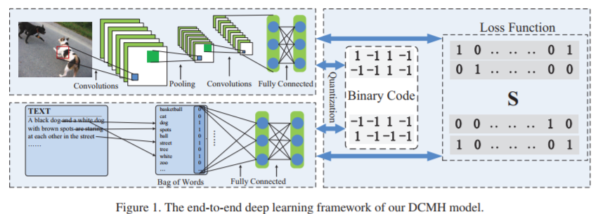
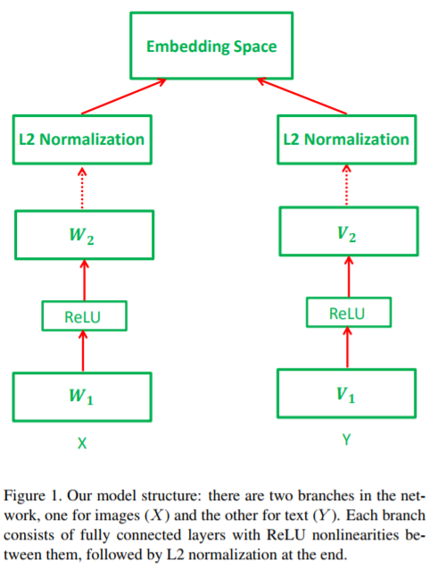
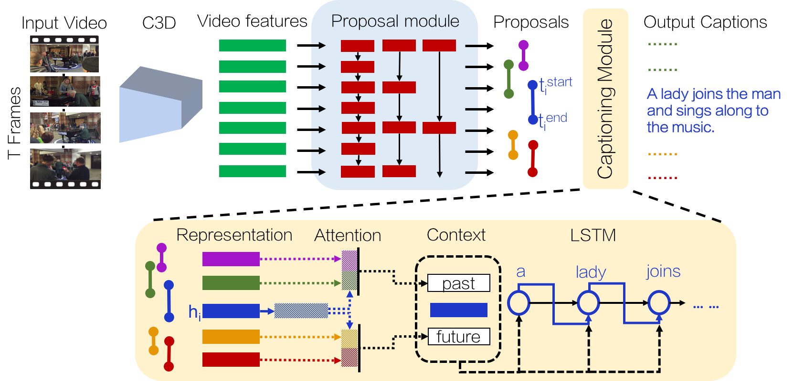
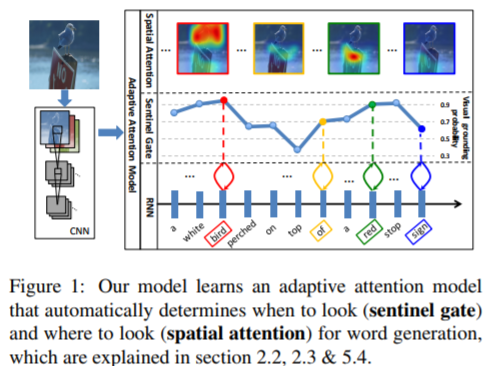
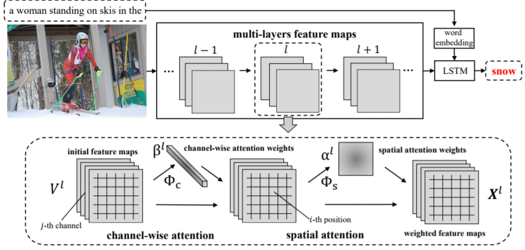
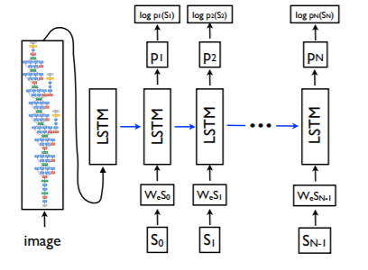
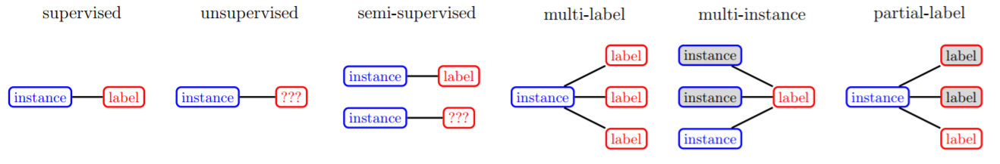
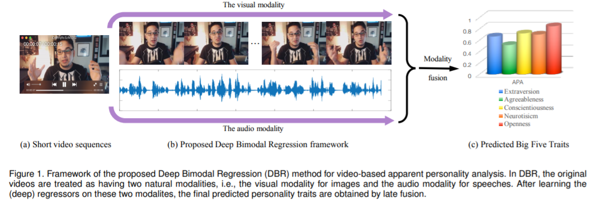
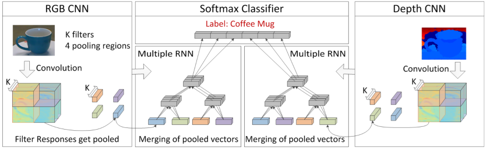
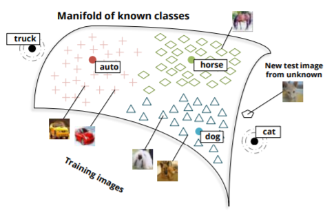

# Recommended Papers  
## [Home](../README.md)
- The goal of this document is to provide a reading list in Multimodal learning.

## Topics
- [Cross-modal retrieval](#cross-modal-retrieval)
- [Image Captioning](#image-captioning)
- [Video Descriptions](#video-descriptions)
- [Visual Question-Answer (VQA)](#visual-question-answer)
- [Human Pose Estimation](#human_pose_estimation)
- [Emotion](#emotion)
- [Medical](medical/medical.md)
- [3D Object Classification](#3d_object_classification)
- [Others](#others)
- [Multimodal Machine Learning](https://sites.google.com/site/multiml2016cvpr/)

## Five main __challenges__ in multimodal machine learning [link](https://sites.google.com/site/multiml2016cvpr/)
-  multimodal representation learning
-  translation & mapping
-  modality alignment
-  multimodal fusion 
-  co-learning

## Papers
Paper list.

## Cross-modal retrieval

### 2017
|No.  |Figure   |Title   |Authors  |Pub.  |Links|Datasets|
|-----|:-----:|:-----:|:-----:|:-----:|:---:|:---:|
|1||__Deep Cross-Modal Hashing__| [Qing-Yuan Jiang](http://lamda.nju.edu.cn/jiangqy/) and [Wu-Jun Li](https://cs.nju.edu.cn/lwj/)|__CVPR 2017__|[PDF](http://lamda.nju.edu.cn/jiangqy/paper/CVPR17_DCMH.pdf)  解读| [MIRFLICKR-25K]() [NUS-WIDE]() [IAPR TC-12]()|
|2||__Learning Deep Structure-Preserving Image-Text Embeddings__| L. Wang, Y. Li, and [S. Lazebnik](http://web.engr.illinois.edu/~slazebni/)|__PAMI 2017__|[PDF](http://web.engr.illinois.edu/~slazebni/publications/pami17_twobranch.pdf) ||
|3||__Pairwise Relationship Guided Deep Hashing for Cross-Modal Retrieval__| Erkun Yang, [Cheng Deng](https://scholar.google.com.hk/citations?hl=zh-CN&user=OROjmc8AAAAJ&view_op=list_works&sortby=pubdate), Wei Liu, Xianglong Liu, Dacheng Tao, Xinbo Gao|__AAAI 2017__|[PDF](https://aaai.org/ocs/index.php/AAAI/AAAI17/paper/view/14326/13959) ||

### 2016
|No.  |Figure   |Title   |Authors  |Pub.  |Links|Datasets|
|-----|:-----:|:-----:|:-----:|:-----:|:---:|:---:|
|1||__Learning Deep Structure-Preserving Image-Text Embeddings__| L. Wang, Y. Li, and [S. Lazebnik](http://web.engr.illinois.edu/~slazebni/)|__CVPR 2016__|[PDF](http://web.engr.illinois.edu/~slazebni/publications/cvpr16_structure.pdf)||

## Image Captioning

### 2017
|No.  |Figure   |Title   |Authors  |Pub.  |Links|Datasets|
|-----|:-----:|:-----:|:-----:|:-----:|:---:|:---:|
|1||__Attend to You: Personalized Image Captioning with Context Sequence Memory Networks__|Cesc Chunseong Park, Byeongchang Kim and Gunhee Kim|__CVPR 2017__|[PDF](https://arxiv.org/abs/1704.06485) [code](https://github.com/cesc-park/attend2u) 解读|[IntaPIC-1.1M Json](https://drive.google.com/uc?export=download&id=0B3xszfcsfVUBdG0tU3BOQWV0a0E) [IntaPIC-1.1M Image](https://drive.google.com/ucexport=download&id=0B3xszfcsfVUBVkZGU2oxYVl6aDA)|
|2||__Dense-Captioning Events in Videos__|Ranjay Krishna, Kenji Hata, Frederic Ren, [Fei-Fei, Li](http://vision.stanford.edu/publications.html#year2017), Juan Carlos Niebles|__CVPR 2017__|[PDF](https://arxiv.org/abs/1705.00754) [Project](http://cs.stanford.edu/people/ranjaykrishna/densevid/) 解读|[ActivityNet Captions](http://cs.stanford.edu/people/ranjaykrishna/densevid/captions.zip)|
|3||__Knowing When to Look: Adaptive Attention via A Visual Sentinel for Image Captioning__|Jiasen Lu, Caiming Xiong, Devi Parikh, [Richard Socher](http://www.socher.org/)|__CVPR 2017__|[PDF](https://arxiv.org/pdf/1612.01887.pdf)||
|4||__SCA-CNN: Spatial and Channel-wise Attention in Convolutional Networks for Image Captioning__|Long Chen, Hanwang Zhang, Jun Xiao, Liqiang Nie, Jian Shao, Wei Liu, Tat-Seng Chua|__CVPR 2017__|[PDF](https://arxiv.org/pdf/1611.05594.pdf)||

### 2016
|No.  |Figure   |Title   |Authors  |Pub.  |Links|Datasets|
|-----|:-----:|:-----:|:-----:|:-----:|:---:|:---:|
|2||__Show and Tell: Lessons learned from the 2015 MSCOCO Image Captioning Challenge__| [Oriol Vinyals](https://research.google.com/pubs/OriolVinyals.html), Alexander Toshev, Samy Bengio, Dumitru Erhan|__PAMI 2016__|[PDF](https://arxiv.org/abs/1609.06647) [github](https://github.com/tensorflow/models/tree/master/research/im2txt) 解读|[COCO](http://cocodataset.org/#home)|

### 2015
|No.  |Figure   |Title   |Authors  |Pub.  |Links|Datasets|
|-----|:-----:|:-----:|:-----:|:-----:|:---:|:---:|
|1||__Show and tell: A neural image caption generator__| [Oriol Vinyals](https://research.google.com/pubs/OriolVinyals.html), Alexander Toshev, [Samy Bengio](http://bengio.abracadoudou.com/), Dumitru Erhan|__CVPR 2015__|[Smile](https://static.googleusercontent.com/media/research.google.com/zh-CN//pubs/archive/43274.pdf)  解读| [COCO](http://cocodataset.org/#home)|

## Video Descriptions

### code
[视频内容问答](https://www.leiphone.com/news/201705/qtBJ3lsLVJ1TPrwK.html)

## Visual Question-Answer

## Human Pose Estimation

### 2013
|No.  |Figure   |Title   |Authors  |Pub.  |Links|Datasets|
|-----|:-----:|:-----:|:-----:|:-----:|:---:|:---:|
|1||__MODEC: Multimodal Decomposable Models for Human Pose Estimation__| Ben Sapp, Ben Taskar|__CVPR 2013__|[PDF](https://www.cv-foundation.org/openaccess/content_cvpr_2013/papers/Sapp_MODEC_Multimodal_Decomposable_2013_CVPR_paper.pdf)  解读| 

## Emotion

### 2017
|No.  |Figure   |Title   |Authors  |Pub.  |Links|Datasets|
|-----|:-----:|:-----:|:-----:|:-----:|:---:|:---:|
|1||__Deep Bimodal Regression of Apparent Personality Traits from Short Video Sequences__|[Xiu-Shen Wei](http://210.28.132.67/weixs/?AspxAutoDetectCookieSupport=1), [Chen-Lin Zhang](http://210.28.132.67/zhangcl/), [Hao Zhang](http://210.28.132.67/zhangh/), and [Jianxin Wu](https://cs.nju.edu.cn/wujx/) |__IEEE Transactions on Affective Computing 2017__|[PDF](http://lamda.nju.edu.cn/weixs/publication/tac17.pdf) [Projeact](http://lamda.nju.edu.cn/weixs/project/APA/APA.html)||

## 3D Object Classification

### 2012
|No.  |Figure   |Title   |Authors  |Pub.  |Links|Datasets|
|-----|:-----:|:-----:|:-----:|:-----:|:---:|:---:|
|1||__Convolutional-Recursive Deep Learning for 3D Object Classification__|[Richard Socher](http://www.socher.org/), Brody Huval, Bharath Bhat, [Christopher D. Manning](https://nlp.stanford.edu/manning/), Andrew Y. Ng |__NIPS 2012__|[PDF](http://papers.nips.cc/paper/4773-convolutional-recursive-deep-learning-for-3d-object-classification.pdf) [Projeact](http://www.socher.org/index.php/Main/Convolutional-RecursiveDeepLearningFor3DObjectClassification)||

## Others
### 2013
|No.  |Figure   |Title   |Authors  |Pub.  |Links| Datasets |
|-----|:-----:|:-----:|:-----:|:-----:|:---:|:---:|
|1||__Zero-Shot Learning Through Cross-Modal Transfer__|[Richard Socher](http://www.socher.org/)and Milind Ganjoo and [Christopher D. Manning](https://nlp.stanford.edu/manning/) and Andrew Y. Ng |__NIPS 2013__|[PDF](https://nlp.stanford.edu/~socherr/SocherGanjooManningNg_NIPS2013.pdf) [Projeact](http://www.socher.org/index.php/Main/Zero-ShotLearningThroughCross-ModalTransfer)||

### 团队

[中科院模式识别国家重点实验室](http://www.nlpr.ia.ac.cn/CN/model/index.shtml)

### 关注的人
LAMDA团队

[蒋庆远](http://lamda.nju.edu.cn/jiangqy/)
[吴建鑫](https://cs.nju.edu.cn/wujx/)
[叶翰嘉](http://lamda.nju.edu.cn/yehj/)

[赫　然](http://www.cebs.ac.cn/duiwu_teacher.php?id=57)
[王　亮](http://www.cebs.ac.cn/duiwu_teacher.php?id=69)

