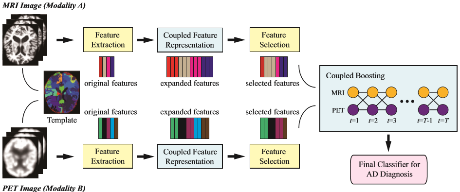

# Medical  
## [Home](../../README.md)
- The goal of this document is to provide a reading list in Medical.

## Topics
- [The type of the edical images](#the-type-of-the-edical-images)
- [Pipeline for the medical tasks](#pipeline-for-the-medical-tasks)
- [Disease](#disease)
- [Papers](#papers)
- [Lab](#lab)
- [People](#people)
- [Datasets](#datasets)
- [Software](#software)
- [References](#references) 

## Disease
 [Alzheimer’s disease](https://en.wikipedia.org/wiki/Alzheimer%27s_disease) (AD) and its prodrome, mild cognitive impairment (MCI).

[Topics](#topics)

## The type of the edical images
[MRI](https://en.wikipedia.org/wiki/Magnetic_resonance_imaging)(Magnetic resonance imaging)
is a medical imaging technique used in radiology to form pictures of the anatomy and the physiological processes of the body in both health and disease. MRI scanners use strong magnetic fields, radio waves, and field gradients to generate images of the organs in the body. MRI does not involve x-rays, which distinguishes it from computed tomography (CT or CAT).

[PET](https://en.wikipedia.org/wiki/Positron_emission_tomography)(Positron emission tomography)
is a nuclear medicine functional imaging technique that is used to observe metabolic processes in the body. The system detects pairs of gamma rays emitted indirectly by a positron-emitting radionuclide (tracer), which is introduced into the body on a biologically active molecule. Three-dimensional images of tracer concentration within the body are then constructed by computer analysis. In modern PET-CT scanners, three-dimensional imaging is often accomplished with the aid of a CT X-ray scan performed on the patient during the same session, in the same machine.

[Positron emission tomography–computed tomography](https://en.wikipedia.org/wiki/PET-CT) (better known as PET-CT or PET/CT) is a nuclear medicine technique which combines, in a single gantry, a positron emission tomography (PET) scanner and an x-ray computed tomography (CT) scanner, to acquire sequential images from both devices in the same session, which are combined into a single superposed (co-registered) image. Thus, functional imaging obtained by PET, which depicts the spatial distribution of metabolic or biochemical activity in the body can be more precisely aligned or correlated with anatomic imaging obtained by CT scanning. Two- and three-dimensional image reconstruction may be rendered as a function of a common software and control system.

## Pipeline for the medical tasks
<ol>
<li>Image preprocessing and feature extraction
	<ol>
		<li>skull-stripped </li>
		<li>cerebellum-removed</li>
	</ol>
</li>
</ol>

[Topics](#topics)

## Papers
Paper list.

|No.  |Figure   |Title   |Authors  |Pub.  |Links|Datasets|
|-----|:-----:|:-----:|:-----:|:-----:|:---:|:---:|
|1||__Joint Coupled-FeatureRepresentation and Coupled Boosting for AD Diagnosis__|[Yinghuan Shi](https://cs.nju.edu.cn/shiyh/), [Heung-Il Suk](https://www.ku-milab.org/people), Yang Gao, [Dinggang Shen](https://www.unc.edu/~dgshen/) |__[CVPR 2014](http://www.cvpapers.com/cvpr2014.html)__|[PDF](pdf/Joint Coupled-FeatureRepresentation and Coupled Boosting for AD Diagnosis.pdf)   | ADNI|

[Topics](#topics)

## Lab
[LONI](http://loni.usc.edu/) (Laboratory of Neuro Imaging) is in Keck School of Medicine of USC 
[University of Southern California](https://www.usc.edu/).

[MiLab](https://www.ku-milab.org/) (Machine Intelligence Laboratory at [Korea University](https://www.korea.edu/)) is devoted to the development of computational models and their applications to various researches in the brain and cognitive engineering field. Specifically, we focus on 1) pattern recognition and machine learning algorithms inspired from the neural information processing mechanism in a human brain, 2) brain disease diagnosis or prognosis by analyzing complex patterns inherent in neuroimaging or genetic data, and 3) non-invasive brain-computer interfaces to enhance human performance.

[IDEA Lab](http://www.med.unc.edu/bric/ideagroup/core-labs/idea-research-lab)

[Topics](#topics)

## People

[Topics](#topics)

## Datasets
[Alzheimer’s Disease Neuroimaging Initiative](http://adni.loni.usc.edu/) (ADNI) dataset.

[Topics](#topics)

## Software
[LONI](http://loni.usc.edu/Software/)

[Topics](#topics)

## References

[Topics](#topics)
