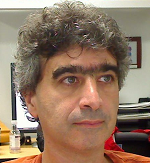

# Peoples   
## [Home](../README.md)
## [Stanford AI Courses](http://ai.stanford.edu/courses/)
- The goal of this document is to provide a people list.

|Image  |Name   | Links|Course
|-----|:-----:|:-----:|:-----:|
|| [Geoffrey E. Hinton](http://www.cs.toronto.edu/~hinton/)|[Machine learning](http://www.cs.toronto.edu:40292/)| |
|| [Yann Lecun](http://yann.lecun.com/)|[CILVR Lab](https://wp.nyu.edu/cilvr/)| |
|| [Yoshua Bengio](https://mila.quebec/personne/bengio-yoshua/)|[MILA](https://mila.quebec/)| |
|| [Andrew Ng](http://www.andrewng.org/)| [Group](http://www.andrewng.org/my-group/)   [Google+](https://plus.google.com/113710395888978478005)| |
|| [Samy Bengio](http://bengio.abracadoudou.com/)| | |
|| [Feifei Li](http://vision.stanford.edu/feifeili/)| [Vision Lab](http://vision.stanford.edu/)| [cs231n home](http://cs231n.stanford.edu/)[Chinese](http://study.163.com/course/introduction/1003223001.htm) [English](https://www.youtube.com/playlist?list=PLkt2uSq6rBVctENoVBg1TpCC7OQi31AlC)|
|| [Christopher Manning](https://nlp.stanford.edu/manning/)| [stanford nlp group](https://nlp.stanford.edu/people/)|[cs224n](https://web.stanford.edu/class/cs224n/)[278](http://web.stanford.edu/class/linguist278/)|
|| [Andrej karpathy](http://bengio.abracadoudou.com/)|[github](https://github.com/karpathy) | |
|| [Justin Johnson](http://cs.stanford.edu/people/jcjohns/)|[github](https://github.com/jcjohnson) | |
|| [Svetlana Lazebnik](http://web.engr.illinois.edu/~slazebni/)|| |

[Deep Learning Research Groups](http://deeplearning.net/deep-learning-research-groups-and-labs/)

[datasets1](http://www.jianshu.com/p/9990284bc4d5)
[datasets2](http://deeplearning.net/datasets/)

